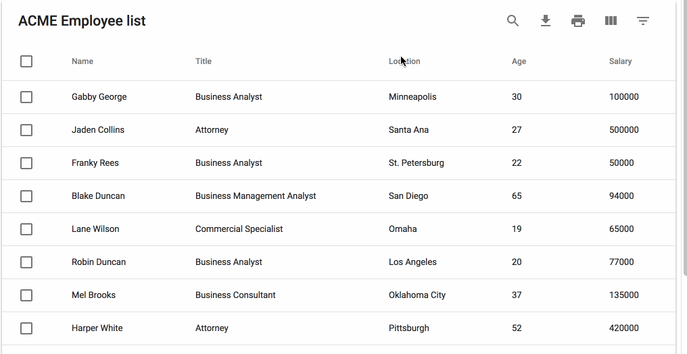

<br />
<p align="center">
  
  <h3 align="center">Muidatatables-server</h3>

  <p align="center">
    Server side rendering for Material UI React Datatables.
    <br />
    <a href="https://github.com/gregnb/mui-datatables" target="_blank"><strong>mui-datatables</strong></a>
    <br />
  </p>
  
  <a href="https://github.com/huonix/muidatatables-server">
    
  </a>
</p>

### Prerequisites

This is an example of how to use server side listing with search options and ordering on the material ui datatable component in PHP.

* Laravel 5
* React JS
* Material UI

### Usage Example on a component

```JS
class Company extends Component {

    state = {
        lastTableState: null,
        firstLoad: true,
        title: 'Listagem',
        columns: [
            {
                'name': 'active',
                'options': {
                    'customBodyRender': (value, tableMeta, updateValue) => {
                        return value ?
                            <Icon className="text-green text-20">check_circle</Icon> :
                            <Icon className="text-red text-20">remove_circle</Icon> ;
                    }
                }
            }
        ],
        data: [],
        options: {
            //extend your language options here if you need it
            elevation: 0,
            filter: true,
            filterType: 'textField',
            responsive: 'scroll',
            serverSide: true,
            selectableRows: true,
            customToolbarSelect: (selectedRows, displayData, setSelectedRows) => (
                <div className={"custom-toolbar-select"}></div>
            ),
            onCellClick: (colData, cellMeta) => {
                if(this.state.data.length > 0) {
                    let id = this.state.data[cellMeta.rowIndex][0];
                    this.props.history.push('/companies/' + id);
                }
            },
            onTableChange: (action, tableState) => {
                switch(action) 
                {
                    case 'search':
                    case 'filterChange':
                    case 'resetFilters':
                    case 'sort':
                    case 'changePage':
                    case 'changeRowsPerPage':
                    {
                        this.updateTable(tableState);
                        break;
                    }    
                    default: break;
                }      
            }
        }
    };

    columnsMergeWithFunctions = (columns) => {
        return columns.map((row) => {
            let found = this.state.columns.find(function(line) {
                return line.name === row.name;
            });
            let options = (found) ? found.options : {};
            row = {
                ...row,
                options: {
                    ...options,
                    ...row.options,
                }
            };
            return row;
        });
    }

    updateTable = (tableState, removeSearchText) => {
        let filterOptions = tableState || this.state.lastTableState;
        if(removeSearchText && 
            filterOptions && 
            filterOptions.searchText
        ) {
            filterOptions.searchText = '';
        }
        axios.post(`${Emitify.configs.api}/companies/table`, {
            tableOptions: filterOptions
        }).then((response) => {
            let res = response.data;
            res.columns = this.columnsMergeWithFunctions(res.columns);
            this.setState({
                lastTableState: filterOptions,
                firstLoad: false,
                columns: res.columns,
                data: res.data,
                options: {
                    ...this.state.options,
                    ...res.options
                }
            });
        });
    }

    componentDidMount()
    {
        this.updateTable();
    }

    componentDidUpdate(prevProps, prevState)
    {
        if ( !_.isEqual(this.props.location, prevProps.location) )
        {
            this.updateTable();
        }
    }

    render()
    {
        const { title, data, columns, options } = this.state;

        return (
            <MUIDataTable
                title={title}
                data={data} 
                columns={columns} 
                options={options}
            />    
        )
    };
}
```
